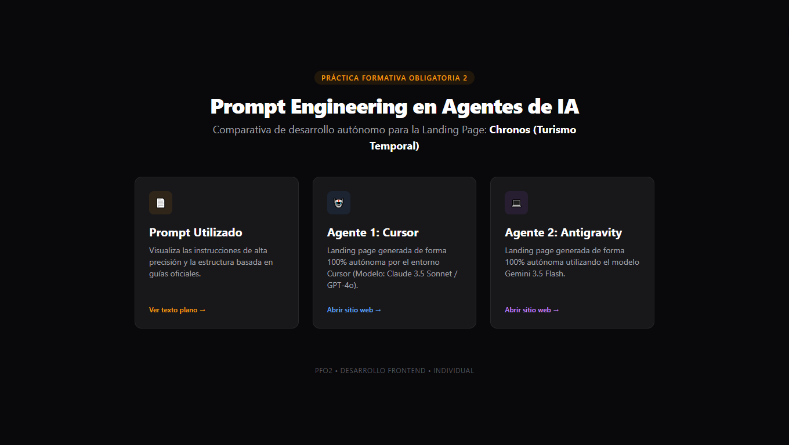
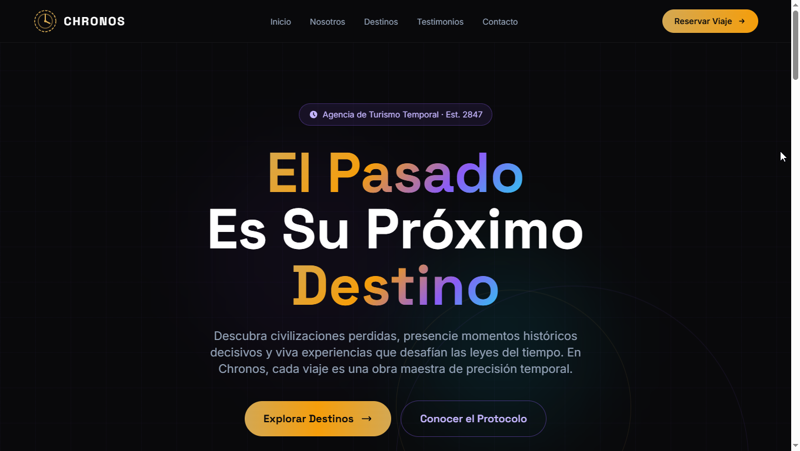
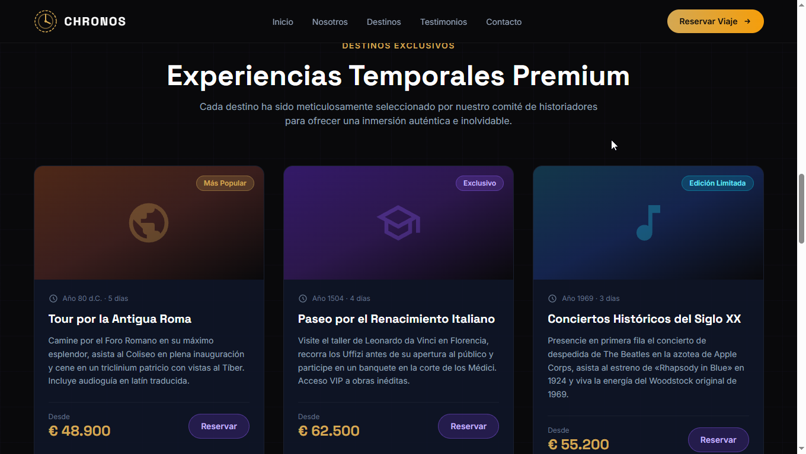
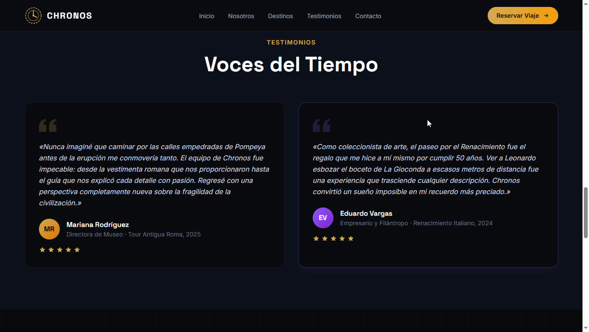
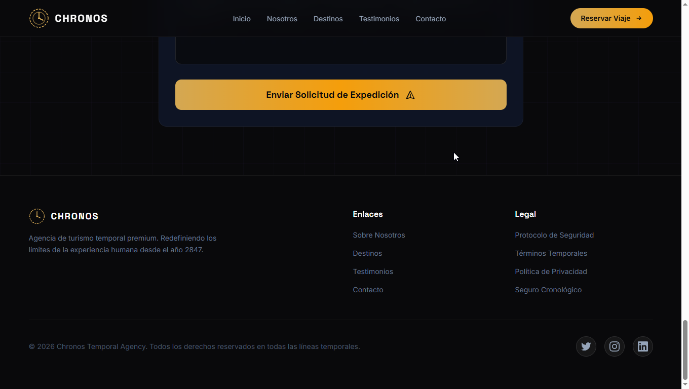
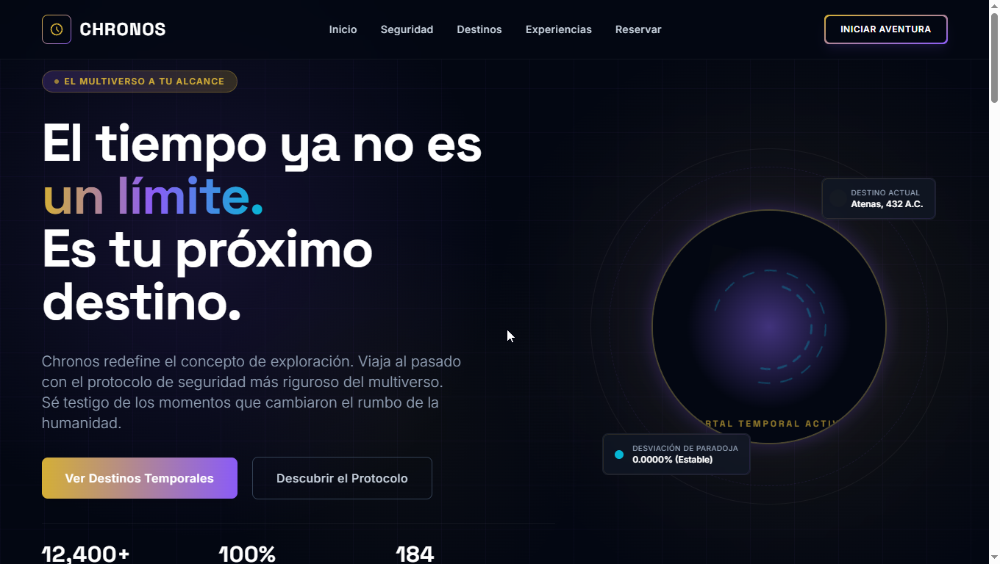
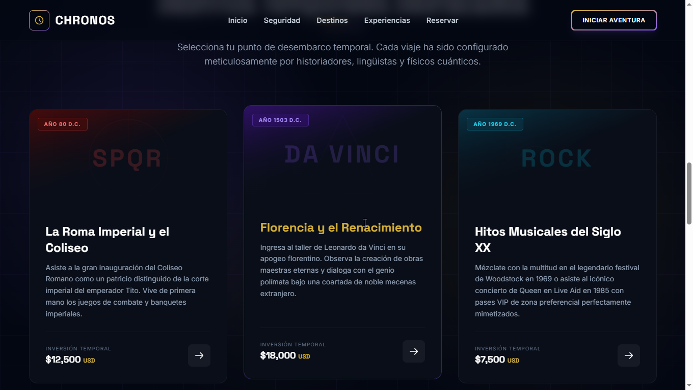
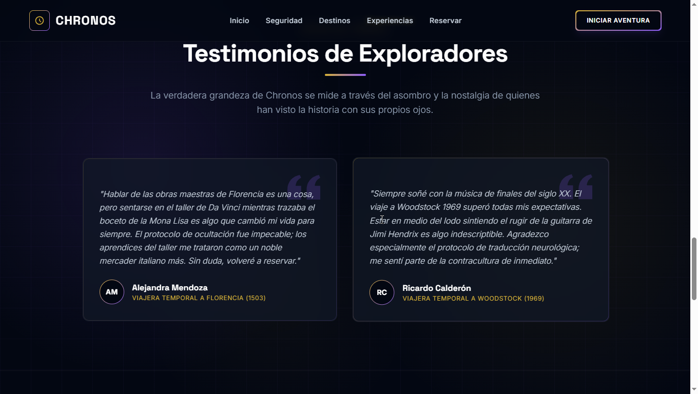
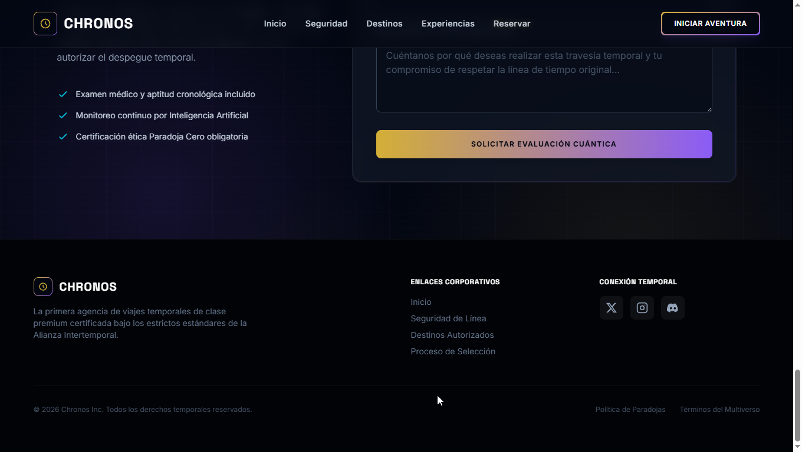

# Práctica Formativa Obligatoria 2: Prompt Engineering en Agentes de IA

## Datos del Estudiante
* **Nombre y Apellido:** SPECTERMAN LUIS OMAR     
* **Asignatura:** Desarrollo Web Frontend 1C 2026
* **Comisión:** Comisión Lunes
* **Fecha de Entrega:** 10/06/2026
---

## 🚀 Enlace al Proyecto Desplegado
A continuación se presenta el acceso único al entorno unificado y desplegado en la plataforma Vercel. La portada raíz funciona como un nodo central de distribución que enlaza de manera organizada al texto plano del prompt y a las dos soluciones independientes:

* **Deploy Oficial (Vercel):** [https://tecnicatura-pf02.vercel.app/]

* **Repositorio Github:** [https://github.com/SpectermanLuis/Tecnicatura_pf02.git]

---
## 📂 Estructura de Directorios del Proyecto

A continuación se detalla la organización del repositorio jerárquico. La estructura refleja fielmente la distribución de las carpetas de los agentes, las capturas de evidencia y la ubicación del archivo de instrucciones:
---

```text
tp-prompt-engineering/
├── index.html         # Portada principal (Interfaz de navegación y distribución)
├── 01.png             # Captura de pantalla portada  principal
├── README.md          # Documentación técnica obligatoria (este archivo)
├── prompt/            # Carpeta contenedora del recurso de instrucción
│   └── prompt.txt     # Archivo de texto plano con el Megaprompt exacto utilizado
├── agente-1/          # Espacio de desarrollo autónomo del Asistente 1 (Cursor)
│   ├── index.html     # Landing Page de Chronos generada por Cursor
│   └── a01.png        # Captura de pantalla de la interfaz de Agente 1
│   └── a02.png        # Captura de pantalla de la interfaz de Agente 1
│   └── a03.png        # Captura de pantalla de la interfaz de Agente 1
│   └── a04.png        # Captura de pantalla de la interfaz de Agente 1
└── agente-2/          # Espacio de desarrollo autónomo del Asistente 2 (Antigravity)
    ├── index.html     # Landing Page de Chronos generada por Antigravity
    └── b01.png        # Captura de pantalla de la interfaz de Agente 2
    └── b02.png        # Captura de pantalla de la interfaz de Agente 2
    └── b03.png        # Captura de pantalla de la interfaz de Agente 2
    └── b04.png        # Captura de pantalla de la interfaz de Agente 2    
```
---

# Temática seleccionada: "Chronos" – Agencia de Turismo Temporal


## 📝 Estructura del Prompt Inicial (Alta Precisión)
Este prompt fue diseñado bajo los lineamientos de las guías de ingeniería de prompts de OpenAI y Anthropic. Estructurado mediante delimitadores temáticos, definición estricta de un rol profesional senior, restricciones semánticas para evitar bloques conversacionales redundantes y directivas de diseño UI/UX responsivas.

````
### ROL Y CONTEXTO
Actúa como un Ingeniero de Software Senior y Diseñador UX/UI Experto. Tu objetivo es crear de forma completamente autónoma una Landing Page profesional, moderna, responsiva y estéticamente impactante para "Chronos", una agencia de turismo premium especializada en Viajes en el Tiempo.

### ESPECIFICACIONES TÉCNICAS
- Tecnologías: Utiliza un único archivo HTML5 de forma limpia. Integra Tailwind CSS mediante su CDN oficial para garantizar un diseño visual de última generación.
- Tipografía e Iconografía: Utiliza fuentes modernas de Google Fonts (como 'Space Grotesk' o 'Inter') y añade iconos visuales usando clases de SVG o FontAwesome/Heroicons embebidos.
- Paleta de Colores: Estética "Luxury Cyber/Temporal". Usa fondos oscuros (slate-900 o zinc-950), texto claro, detalles en dorado/ámbar (para lo premium) y acentos en violeta o cian (para el toque de ciencia ficción).

### RESTRICCIONES ESTRICTAS
- Entrega ÚNICAMENTE el código fuente completo dentro de un bloque de código. NO incluyas introducciones, saludos, ni explicaciones de cómo usarlo antes o después del código.
- Todos los textos, títulos y testimonios deben estar redactados en ESPAÑOL con un tono corporativo, sofisticado y sumamente convincente. Queda estrictamente prohibido usar "Lorem Ipsum".
- Los botones de llamada a la acción (CTA) deben tener transiciones suaves (transition-all duration-300) y efectos hover avanzados (cambio de escala, brillo o cambio de color).

### SECCIONES OBLIGATORIAS (Estructura vertical)
1. Cabecera (Header): Barra de navegación superior fija (sticky) con efecto de desenfoque de fondo (backdrop-blur). Incluye un logotipo textual/isotipo y enlaces de navegación con efectos hover a las secciones.
2. Hero Section: Título masivo y persuasivo sobre viajar en el tiempo (H1), un subtítulo que despierte el deseo de aventura, y un botón principal de llamada a la acción (CTA) que destaque fuertemente.
3. Sobre Nosotros: Una sección elegante que explique brevemente el riguroso protocolo de seguridad temporal de "Chronos" y su trayectoria.
4. Servicios principales (Tarjetas): Una cuadrícula (Grid de mínimo 3 columnas) con tarjetas individuales para los destinos/servicios destacados: "Tour por la Antigua Roma", "Paseo por el Renacimiento Italiano" y "Conciertos Históricos del Siglo XX". Cada tarjeta debe incluir un diseño limpio, título, descripción y precio ficticio.
5. Testimonios: Una fila o grilla con 2 testimonios redactados de clientes que ya viajaron al pasado, detallando su experiencia de forma realista dentro del contexto de la temática.
6. Formulario de Contacto: Un formulario estéticamente integrado con campos para Nombre, Email, Destino Temporal de Interés, un área de mensaje y un botón de envío con diseño destacado (maquetación visual, sin lógica backend).
7. Pie de página (Footer): Enlaces secundarios, derechos de autor simulados para el año actual y botones limpios para redes sociales ficticias utilizando iconos.
````
---

## 🤖 Análisis Comparativo de los Agentes de IA

### Agente 1: Cursor (Modelo Composer 2.5 Fast)
* **Resultado Estético y UI/UX:** Logró un acabado visual premium sobresaliente. La paleta de colores oscuros profundos con acentos en violeta neón y dorado le otorga una identidad visual cibernética muy marcada. La barra de navegación cuenta con un efecto de desenfoque perfectamente integrado, y la cuadrícula de servicios utiliza sombras y bordes sutiles que aportan profundidad.
* **Comportamiento Autónomo:** Cumplió de forma estricta con las especificaciones del prompt. El modelo ignoró explicaciones complementarias y entregó el código HTML embebido de manera directa. La maquetación responsiva se adaptó correctamente gracias a las directivas nativas de Tailwind CSS.

### Agente 2: Antigravity (Motor Gemini 3.5 Flash )
* **Resultado Estético y UI/UX:** Presentó una propuesta frontend sumamente ágil y limpia, enfocada en un diseño estructural directo. Si bien respetó la paleta de colores oscuros de la temática "Chronos", priorizó una maquetación más ligera y funcional. Los componentes interactivos y los efectos hover resultaron efectivos, aunque con resoluciones visuales más estandarizadas en comparación con el ecosistema de Cursor.
* **Comportamiento Autónomo:** Mostró una excelente interpretación de las restricciones de salida ("Output Restrictions"). Al ser un agente enfocado en la ejecución directa y con "menos vueltas" conversacionales, procesó el Megaprompt de forma óptima, absteniéndose de añadir introducciones o textos de relleno decorativos fuera del archivo HTML5 único en español.

---

## 📈 Conclusiones de la Práctica
#### La implementación de una única instrucción estructurada de alta precisión (Megaprompt) evidenció el potencial actual de las herramientas generativas para actuar como asistentes autónomos de software frontend. Ambos agentes lograron interpretar las restricciones de diseño, maquetar con componentes modernos mediante Tailwind CSS y omitir las respuestas conversacionales para no romper el flujo de desarrollo.

#### Como conclusión técnica, se observa que Cursor ofrece una ventaja cualitativa en el refinamiento estético minucioso y la fluidez de los efectos visuales complejos debido a su entorno especializado de desarrollo. Por otro lado, Antigravity demostró ser una alternativa sumamente eficiente para flujos de trabajo rápidos, destacando por su velocidad de respuesta y por ir "directo al grano" en la entrega del código limpio, cumpliendo con precisión matemática la regla de no incorporar explicaciones redundantes.
---

## 📸 Evidencia Visual (Capturas de Pantalla)

### Pantalla Principal Integradora 


### Interfaz del Sitio - Agente 1 (Cursor)









### Interfaz del Sitio - Agente 2 (Antigravity)








